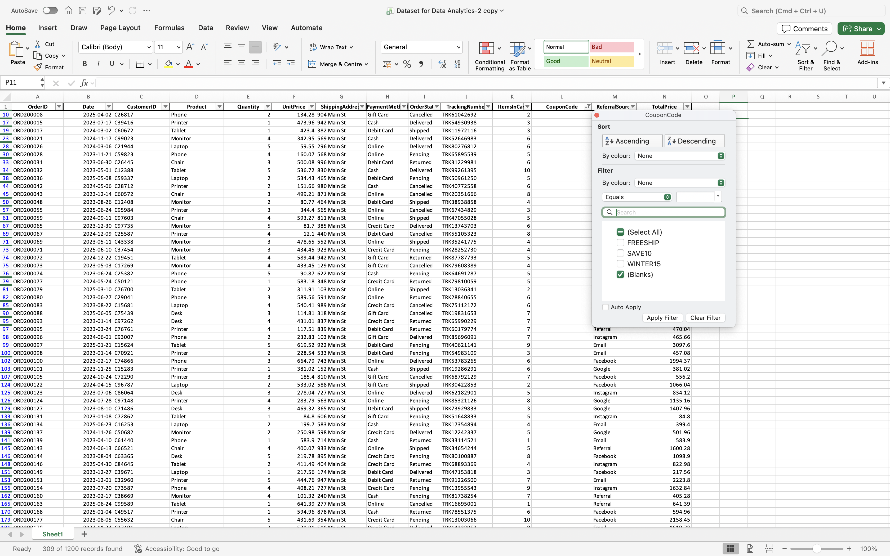
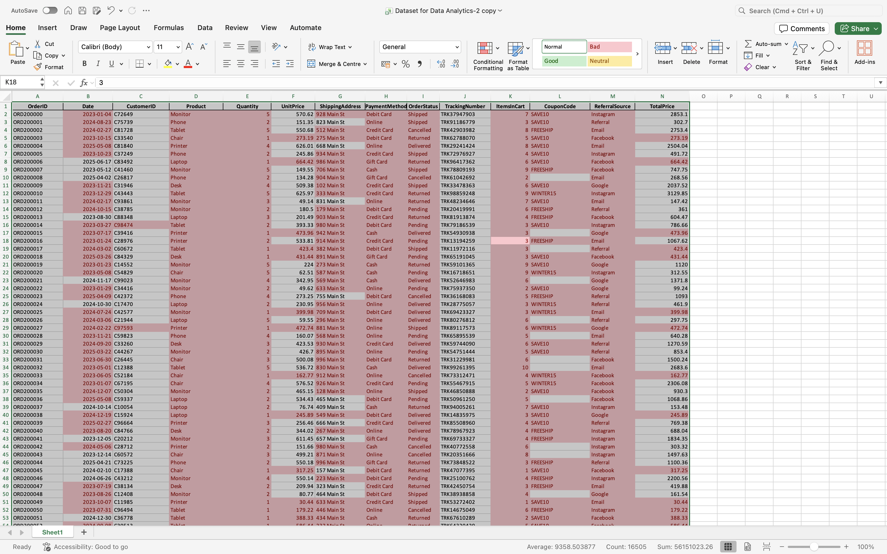
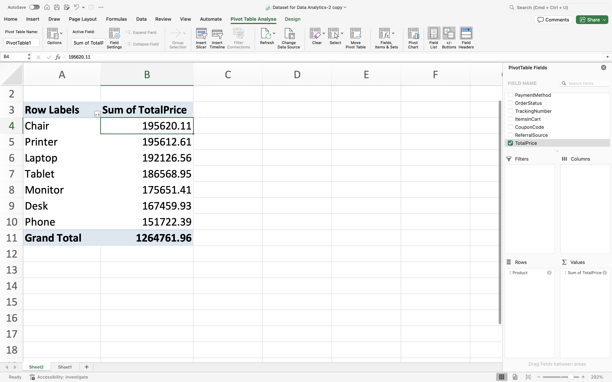
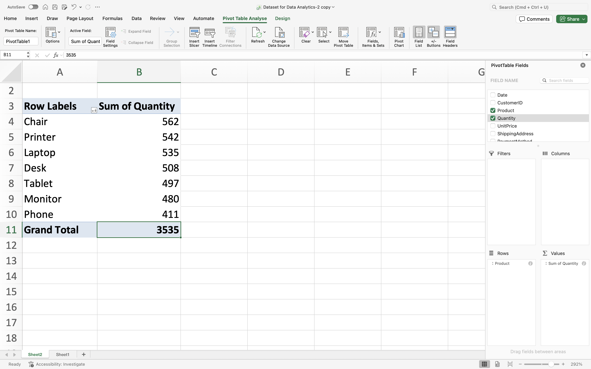

# Sales Data Cleaning & Analysis

## Project Overview

This project focuses on cleaning and preparing a sales dataset for analysis using Microsoft Excel.

## Objectives

* Identify missing values
* Check for duplicate records
* Correct data formatting issues
* Validate calculations
* Prepare data for business analysis

## Data Cleaning Tasks Completed

### Missing Values

* Investigated missing CouponCode records
* Identified blank entries using filters and COUNTBLANK()

### Missing Values Check

---

### Duplicate Checks

* Examined OrderID records
* Verified that repeated OrderIDs represented valid transactions rather than duplicates

### Duplicate Check

---

### Data Validation

Verified TotalPrice calculations using:

**TotalPrice = Quantity × UnitPrice**

Example:

3 × 499.21 = 1497.63

---

## Analysis Performed

### Revenue by Product

### Quantity Sold by Product

---

## Key Findings

* Chair generated the highest revenue (£195,620.11)
* Printer generated the second-highest revenue (£195,612.61)
* Phone generated the lowest revenue (£151,722.39)
* Chair recorded the highest quantity sold (562 units)
* Phone recorded the lowest quantity sold (411 units)

---

## Tools Used

* Microsoft Excel
* Pivot Tables
* Filters
* COUNTBLANK()
* Data Validation

---

## Author

**Lydia Akosah**
Aspiring Data Analyst | MSc Digital Health
